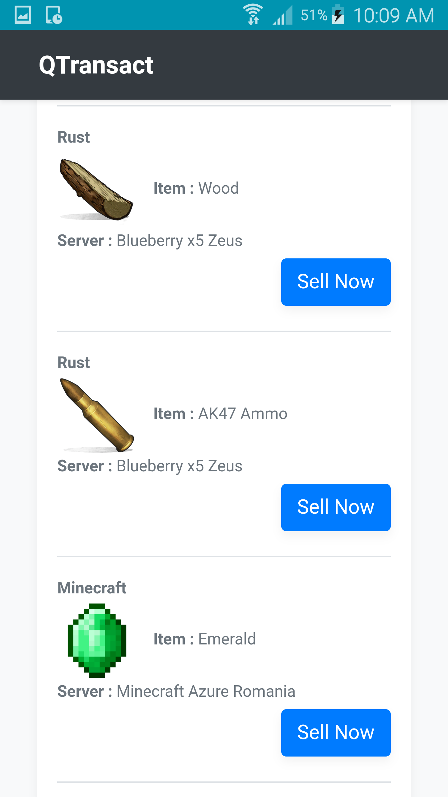

## Description

QTransact is a trading platform for virtual goods, irrespective of the "world" they are contained in. For example, you can use the platform to validate transactions between a Minecraft private server and community GTA5 servers. The process of transfering ownership via the QTransact platform is automated by the API and does not allow scams. It can be implemented in any multiplayer game, through a plugin / module that uses the QTransact REST API.

If the target game already allows players to trade items between them, QTransact allows for remote transactions ( you don't have to be in front of a computer to do be able to trade ).

## Technologies

The transactions are processed by the main QTransact server, through the REST API.
The mobile app ( qtransact-client ) connects to this server and requests the inventory and the offers for the user. This client is developed as a web page ( HTML + CSS + JS ) and it is packaged as an android / iOS app via Apache Cordova. ( This makes development easier and cross-platform -> it can even be used in a browser )

# How does it work?

# Screenshots

