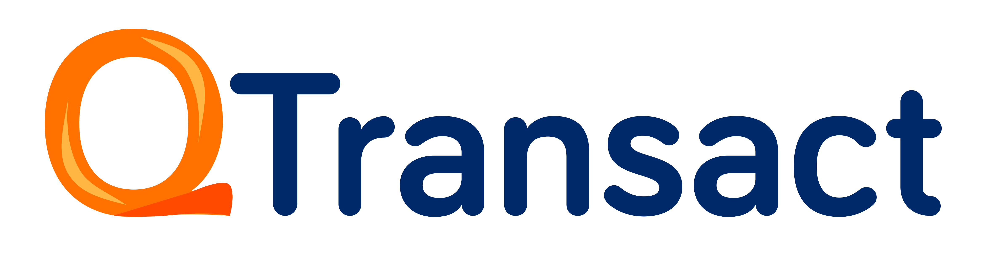
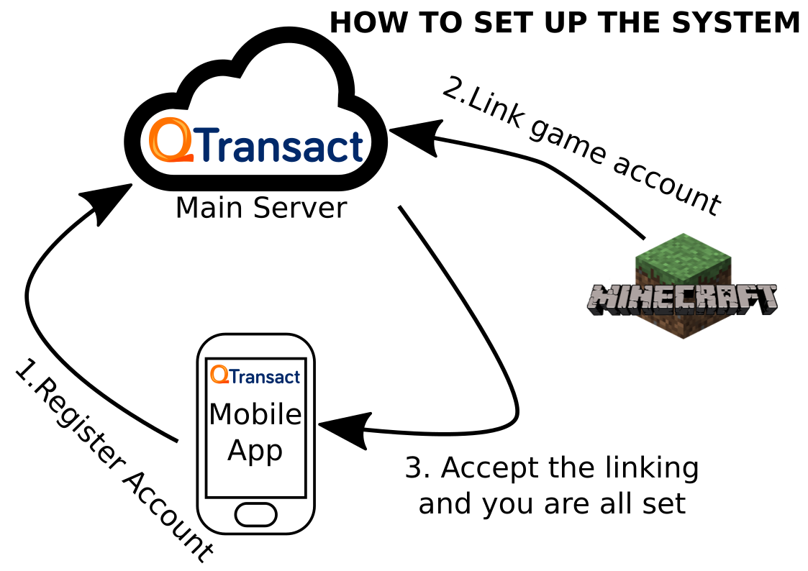
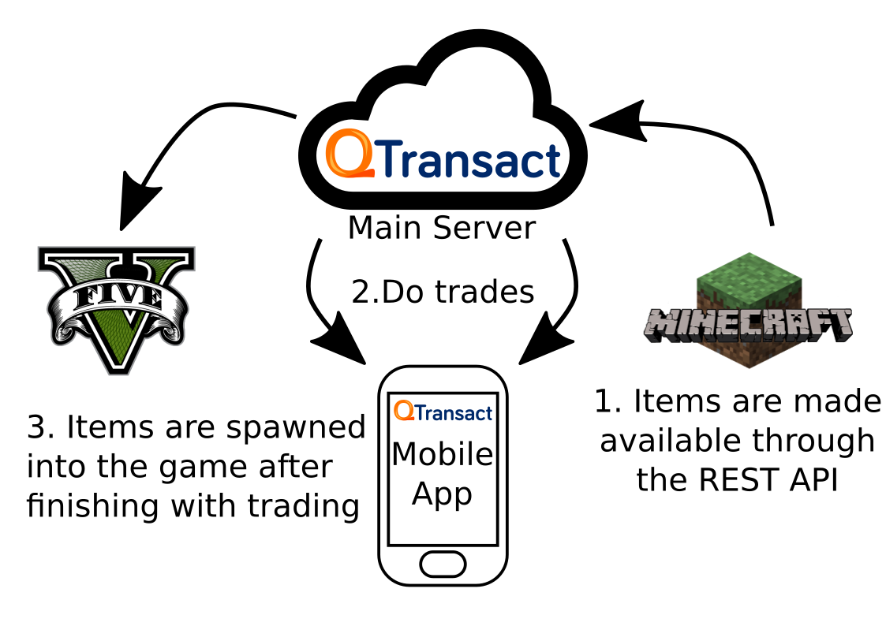
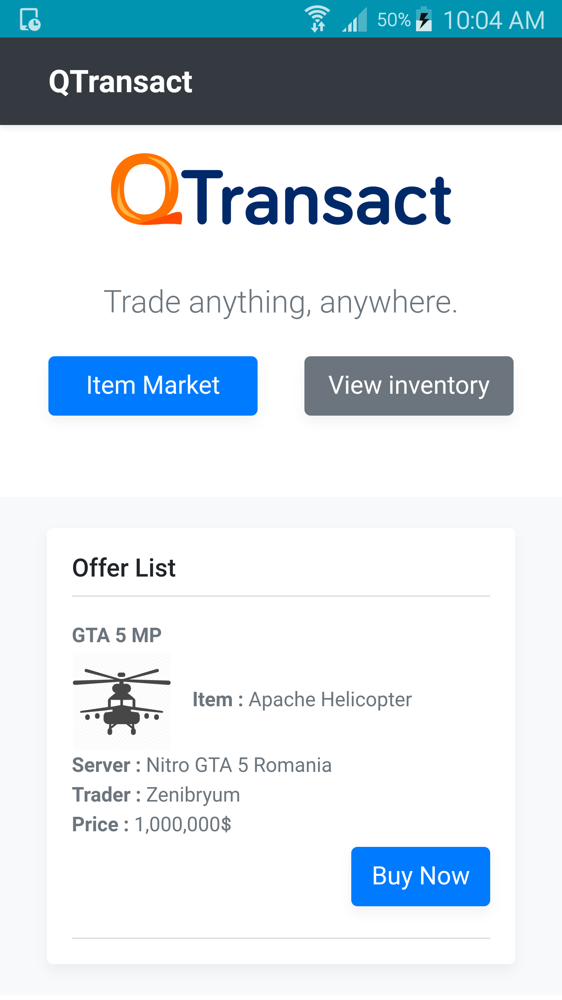
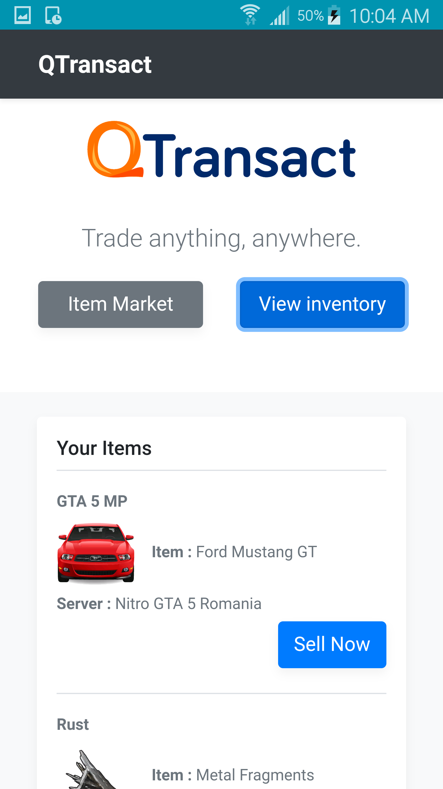
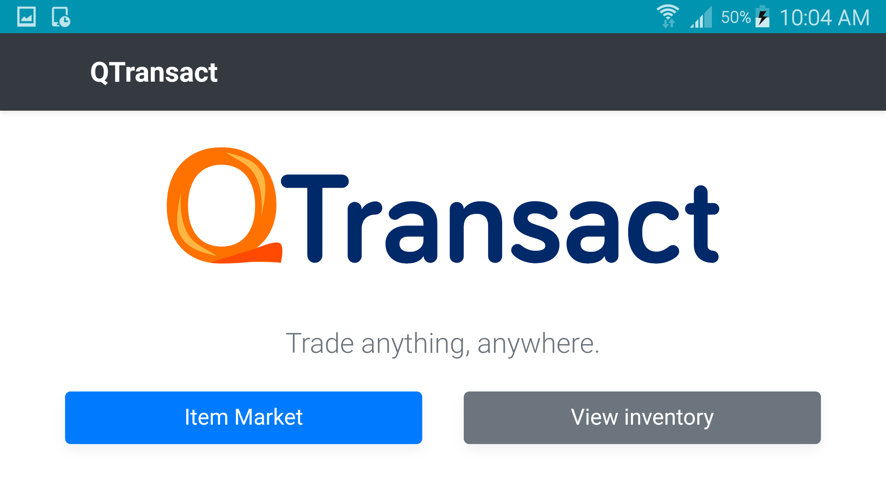

## Descriere

QTransact este o platforma de tranzactionare a obiectelor virtuale pe o piata comuna, indiferent de “lumea” in care exista. De exemplu : se poate folosi pentru a tranzactiona obiecte de pe Minecraft pentru masini pe servere private de GTA 5. Procesul este automatizat si nu permite inselatoriile intre participantii la tranzactie. Sistemul poate fi implementat in orice joc multiplayer, printr-un plugin / modul care foloseste REST API-ul QTransact.
Pentru jocurile care deja permit trocul intre utilizatori, QTransact le permite acestora sa vanda si sa cumpere bunuri virtuale de oriunde, nu doar din fata unui calculator, in cadrul jocului.

## Tehnologii

Tranzactiile sunt procesate de un server principal, prin REST API-ul QTransact.
Aplicatia de mobil se conecteaza la server de unde descarca ofertele si le afiseaza utilizatorului.
Aplicatia a fost dezvoltata ca pagina web ( HTML + CSS + JS ) si ambalata pentru android / iOS cu Apache Cordova.
Cerinte sistem

Aplicatia poate fi compilata pentru Android / iOS, dar interfata este accesibila si din browser.

# Cum functioneaza ?

# Screenshots

